# HSE_FCS_SE-FASM
## Бен Мустафа Анас, БПИ191
Домашняя работа по первому семинару курса "Архитектуры вычислительных систем".

## Программа 1
Классический пример программы "Hello world" на языке Ассемблер без каких-либо дополнений в коде:
- **Код программы** 
  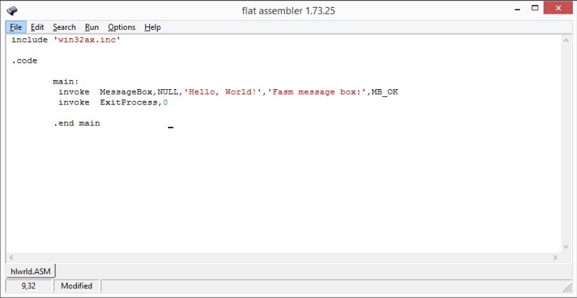 
- **Результат работы** 
  Программа на выходе даёт результат в виде вывода строки "Hello World" на экран.
  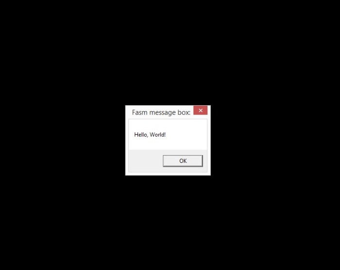 

## Программа 2
Своего рода усовершенствованный вид программы Hello World, который предлагает пользователю выбор:
- **Код программы** 
  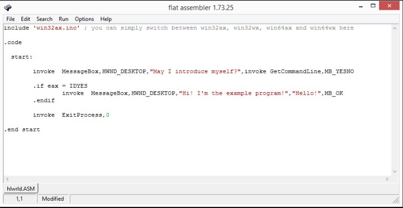 
- **Всплывающее окно выбора** 
  При запуске программы пользователю предлагается следующий выбор:
  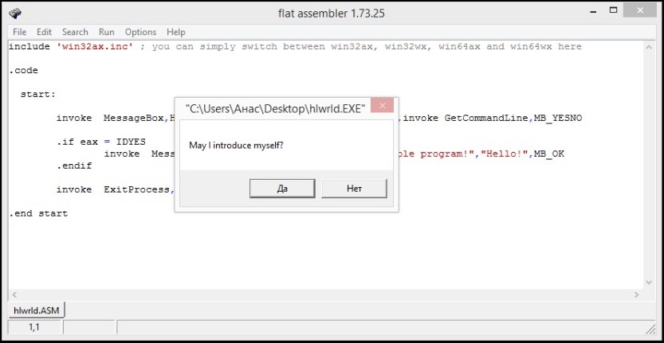 
- **Результат работы** 
  В случае положительного ответа со стороны пользователя, программа высвечивает следующее окно:
  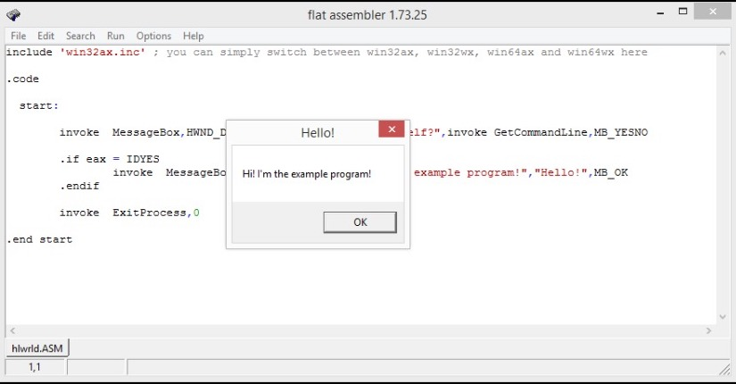 
  
## Программа 3
В Ассемблере достаточно удобный процесс работы с текстовыми файлами. В приведённой ниже программе происходит запись определенного набора символов (строки) в текстовый файл.
- **Код программы** 
  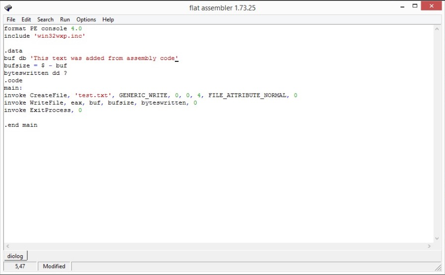 
- **Результат работы** 
  Программа на выходе даёт результат в виде текстового файла с переданной в него строкой.
  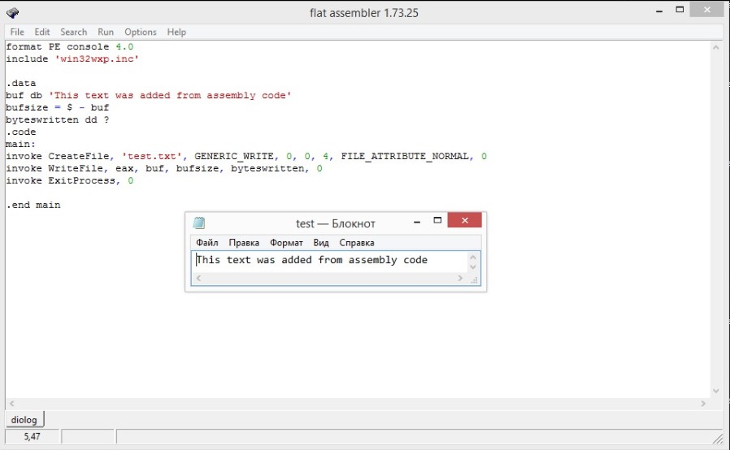 
  
## Программа 4
Приведённая ниже программа взята из папки EXAMPLES и представляет из себя достаточно интересную конструкцию, которая предоставляет возможность вывода опредленного типа Message Box'a в зависимости от выбора пользователя. Пользователю предоставляется возможность ввести описание и текст к месседж боксу.
- **Код программы** 
  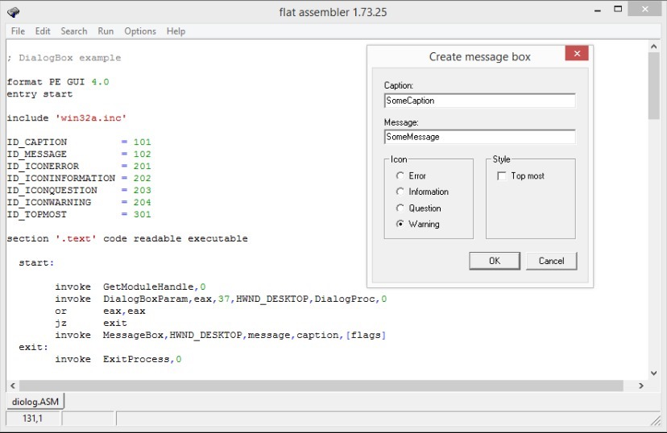 
- **Результат работы** 
  Например, в случае, если пользователь выбирает тип "Warning" с введенными описанием и текстом, на выходе он получит следующий месседж бокс:
  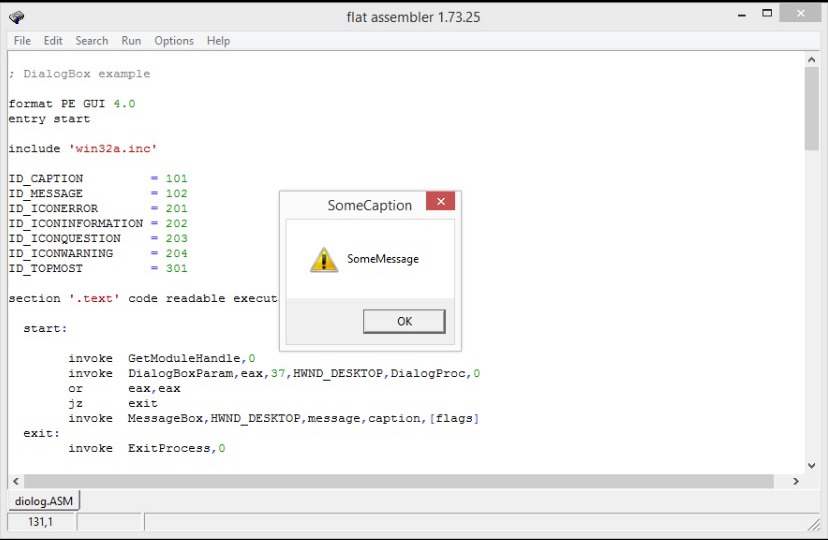 
  
## Программа 5
Для интереса взял также консольную программу. Приведённая ниже программа вычисляет факториал введенного пользователем в консоль числа.
- **Код программы** 
  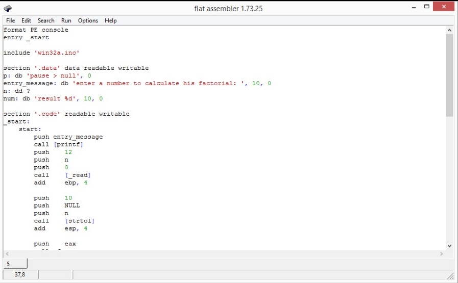 
- **Результат работы** 
  Например, для таких введенных данных мы получаем следующий результат (действительно, факториал числа 6 = 720):
  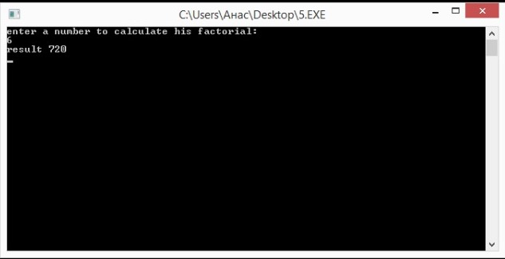 
